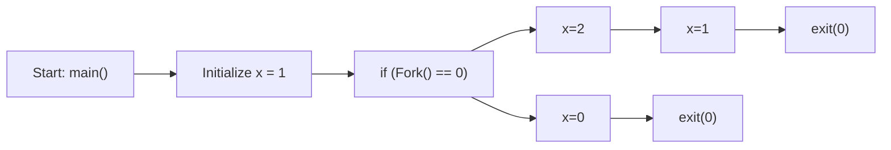

---
# You can also start simply with 'default'
theme: academic
# random image from a curated Unsplash collection by Anthony
# like them? see https://unsplash.com/collections/94734566/slidev
# background: bg.jpg
# some information about your slides (markdown enabled)
title: "06-ECF-and-SysIO"
highlighter: shiki
info: |
  ICS 2025 Fall Slides
# apply unocss classes to the current slide
presenter: true
class: text-center
# https://sli.dev/features/drawing
titleTemplate: '%s'
drawings:
  persist: false
# slide transition: https://sli.dev/guide/animations.html#slide-transitions
transition: fade-out
# enable MDC Syntax: https://sli.dev/features/mdc
mdc: true
fonts:
  sans: '"", "华文中宋", "宋体"'
  serif: '"Consolas", "华文中宋", "宋体"'
  mono: '"Consolas", "华文中宋", "宋体"'

lineNumbers: true

layout: cover
coverBackgroundUrl: /06-ECF-and-SysIO/cover.jpg
---
# ECF & SysIO

Taoyu Yang, EECS, PKU

<style>
  div{
   @apply text-gray-2;
  }
</style>

---

# 控制流

Control Flow

控制流：直观理解就是一条条指令的执行顺序。

处理器读取并执行一串指令序列，程序计数器产生一串相应的序列：$a_0,a_1,\cdots$

每次从 $a_k$ 到 $a_{k+1}$ 的过渡称为 **控制转移**。

---

# 控制转移

Control Transfer

常见：跳转、分支、调用、返回（对程序状态的变化做出反应）

但是，如何对系统状态的变化做出反应？

比如：`Ctrl+C`、请求磁盘、处理异常...

---

# 异常控制流

Exceptional Control Flow

定义：程序执行过程中遇到特殊事件或条件时，改变正常指令执行顺序的机制，它发生在计算机系统的各个层次。

包括：

- 异常
- 进程控制
- 信号
- 非本地跳转

---

# 异常

Exception

异常：控制流的突变。发生异常时，控制流会转移至 **操作系统内核**{.text-sky-5} 以响应某些事件（处理器状态的变化）。

内核：操作系统常驻内存的部分，负责管理计算机硬件和软件资源。

异常处理类似于过程调用，但有区别：

| Diff | 过程调用 | 异常 |
| --- | --- | --- |
| 返回位置 | 返回地址 | 当前指令 $I_{cur}$ / 下一条指令 $I_{next}$ |
| 跳转准备 | 压栈相关信息 | 压栈相关信息，但会额外压栈一些内容 |
| 运行模式 | 用户态 | 内核态 |

---

# 异常的类别

Exception Categories

异常可以分为四类：中断、陷阱、故障、终止。

<div class="text-sm">

| 类别   | 原因                     | 异步 / 同步 | 返回行为               |
|--------|--------------------------|-----------|------------------------|
| 中断（Interrupt）   | 来自 I/O 设备的信号      | 异步  | 总是返回到下一条指令 $I_{next}$   |
| 陷阱（Trap）   | 有意的异常               | 同步      | 总是返回到下一条指令 $I_{next}$   |
| 故障（Fault）   | 潜在可恢复的错误         | 同步      | 可能返回到当前指令 $I_{cur}$     |
| 终止（Abort）   | 不可恢复的错误           | 同步      | 不会返回               |

</div>

<br>

- **异步异常**：是由处理器外部的 I/O 设备中的事件产生的
- **同步异常**：是一条指令的直接产物

辨析：异步异常和当前控制流无关，是来自“外界”的；同步异常和当前控制流有关，是源自当前指令。


---

# 中断

Interrupt

<div grid="~ cols-2 gap-12">
<div>

类型：异步（来自外部）

返回行为：总是返回到下一条指令 $I_{next}$

常见：I / O 设备（磁盘读取完成）、定时器（周期性定时器中断）

</div>

<div>

{.mx-auto}

</div>
</div>

直观理解：

<v-clicks>

1. 你正在写作业，突然你父母（不是你自己写着写着发现的）叫你吃饭（异步）
2. 你得到消息后停笔，但是已经写完的东西不需要再写（$I_{cur}$）
3. 等你吃完饭回来后，你再从写完的字的下一个字开始接着写（$I_{next}$）

</v-clicks>

---

# 陷阱、系统调用

Trap & System Call

<div grid="~ cols-2 gap-12">
<div>

类型：同步（源自当前指令），陷阱是 **故意的异常**{.text-sky-5}

返回行为：总是返回到下一条指令 $I_{next}$

常见：系统调用，如 `write` `read` 等涉及文件 I / O 的指令，`fork` 等涉及进程控制的指令。

</div>

<div>

{.mx-auto}

</div>
</div>


直观理解：

<v-clicks>

1. 你正在写作文，突然你意识到需要引用一段名人名言（同步，故意的）
2. 你停笔去查谷歌，但是已经写完的字不需要再写（$I_{cur}$）
3. 查完谷歌回来后，你再从写完的字的下一个字开始接着写（$I_{next}$）

</v-clicks>

---

# 故障

Fault

<div grid="~ cols-2 gap-12">
<div>

类型：同步（源自当前指令），故障是 **潜在可恢复的错误**{.text-sky-5}

返回行为：可能返回到当前指令 $I_{cur}$

常见：缺页故障、除零错误

</div>

<div>

{.mx-auto}

</div>
</div>

直观理解：

<v-clicks>

1. 你正在写作业，突然你发现自己写错了一段话（$I_{cur}$ 导致了故障）
2. 你停笔找修正带，但是有可能找不到（尝试运行故障处理程序）
3. 如果你能找到，你可以用修正带修正后重新写（$I_{cur}$）
4. 如果找不到，你只能终止这次写作业（`abort`），出门看看能不能买到修正带，或者干脆开摆

</v-clicks> 

---

# 终止

Abort

类型：同步，终止是 **不可恢复的错误**{.text-sky-5}

返回行为：不会返回

常见：非法操作、地址越界、算术溢出、硬件错误

<br>

直观理解：

<v-clicks>

1. 你正在写作业，突然发现你写错题了
2. 直接不写这道题了，拜拜了您内

</v-clicks>

---

# 常见的异常

Common Exceptions

{.mx-auto}

- 中断：外部 I / O 设备
- 陷阱（同步）：故意引发的异常，目的是进行系统调用
- 故障（同步）：出错了，有可能修复。例：**缺页**{.text-sky-5}、除法错误、**一般保护故障（段错误）**{.text-sky-5}
- 终止（同步）：致命错误，无法恢复。例：DRAM/SRAM 损坏

<!--
在这里给大家讲一下 fault 和 abort 的区别

Fault 表示 CPU 在执行某条指令时检测到问题，但仍然可以保存上下文（状态），交给操作系统处理；

Abort 表示 CPU 连基本状态都无法保证正确保存，系统处于“崩坏状态”，无法返回。
-->

---

# 系统调用

System Call

在 x86-64 系统上，系统调用是通过一条称为 `syscall` 的陷阱指令来提供的。

所有 Linux 系统调用的参数都是通过 **通用寄存器**{.text-sky-5} 而不是栈传递的。具体如下：

- 系统调用号：寄存器 `%rax`，**每个系统调用有唯一的整数号**{.text-sky-5}
- 参数寄存器：`%rdi` `%rsi` `%rdx` `%r10` `%r8` `%r9`<br><span class="text-sm text-gray-5">（注意和过程调用有出入，第 4 个参数是 `%r10`，而不是过程调用中的 `%rcx`，[回顾](https://slide.huh.moe/02/13)）</span>

从系统调用返回时，寄存器 `%rcx` 和 `%r11` 都会被破坏，`%rax` 包含返回值 `errno`。

<div class="text-sm text-gray-5">

`errno`：Error Number，错误码，全局变量，存储最近一次系统调用失败的原因。

</div>

返回值在 $-4095$ 到 $-1$ 之间的负数表示发生了错误，对应于负的 `errno`。

---

# 系统调用

System Call

{.mx-auto.h-50}

<div grid="~ cols-2 gap-12">
<div>


```c{all|3-4|5-6}{at:1}
int main()
{
    // 写入 "hello, world\n"
    write(1, "hello, world\n", 13);
    // 退出程序，返回代码为 0
    _exit(0);
}
```

</div>

<div>


```asm{all|9-15|16-20}{maxHeight:'150px',at:1}
.section .data
string:
    .ascii "hello, world\n"    // 字符串 "hello, world\n"
string_end:
    .equ len, string_end - string // 计算字符串长度
.section .text
.globl main
main:
    // 首先，调用 write(1, "hello, world\n", 13)
    movq $1, %rax     // write 是系统调用 1
    movq $1, %rdi     // 参数1：stdout 的描述符是 1
    movq $string, %rsi  // 参数2：hello world 字符串
    movq $len, %rdx    // 参数3：字符串长度
    syscall          // 发起系统调用

    // 然后，调用 _exit(0)
    movq $60, %rax    // _exit 是系统调用 60
    movq $0, %rdi     // 参数1：退出状态码为 0
    syscall          // 发起系统调用
```


</div>
</div>

---

# 进程

Process

假象：好像我们在跑的程序是系统中唯一运行的程序，**独占 CPU 和内存**{.text-sky-5}（然而 `top` 一下很容易打假）

1. **独立的逻辑控制流**：好像我们的程序独占地使用处理器（实际上由 **上下文切换** 的机制实现）
2. **私有的地址空间**：好像我们的程序独占地使用内存（实际上由 **虚拟内存** 机制实现）

**进程（Process）**：一个 **执行中程序的实例**{.text-sky-5}，系统中的每个程序都运行在某个进程的上下文中。

上下文（Context）：直观理解就是程序运行时所需的各种状态信息。

<div class="text-sm">

- 程序的代码和数据
- 栈
- 通用目的寄存器的内容
- 程序计数器
- 环境变量
- 打开文件描述符的集合

</div>

<!-- 

理解上下文：阅读理解题

 -->

---

# 并发流

Concurrent Flow

<div grid="~ cols-3 gap-6">
<div col-span-2>

**并发流**：一个逻辑流的执行在时间上与另一个流重叠。

也即：`A 的开始 ~ A 的结束` 与 `B 的开始 ~ B 的结束` 在时间上重叠。


右图中，从 A 到 B，发生了 **抢占（Preemption）、中断（Interrupt）、上下文切换（Context Switch）**{.text-sky-5}

### 鉴别{.mt-6}

**并行**：同一时刻，多个进程在不同核上运行，并行是并发的真子集。

</div>

<div>


{.mx-auto}

</div>
</div>

---

<div grid="~ cols-2 gap-12" h-full>
<div>

# 私有地址空间

Private Address Space

- **用户区**：地址 $\text{0x400000 }(2^{22}) \sim 2^{48} - 1$
- **内核区**：地址 $\geq 2^{48}$

<span class="text-sm text-gray-5">


实际上，并没有真的分配这么多（假象，用到的很稀疏），而是通过 **虚拟内存映射** 实现的。

</span>

</div>

<div flex="~ col items-center justify-center" h-full>

{.mx-auto}

</div>
</div>

---

# 用户模式 vs 内核模式

User Mode vs Kernel Mode

| 比较项 | 用户模式 | 内核模式 |
| --- | --- | --- |
| 模式位 | 0 | 1 |
| 权限 | 受限 | 不受限 |
| 访存 | 仅限用户区 \* | 任意地址 |
| 特权指令 \*\* | 不能执行 | 可以执行 |

<div class="text-sm text-gray-5">

\* 直接引用地址空间中内核区内的代码和数据会导致保护故障（Abort），但是可以通过 `/proc` 文件系统访问一部分内核数据结构的内容。

\*\* 特权指令：修改模式位、**执行 I/O 操作**{.text-sky-5}、改变内存中的指令流。

</div>

---

# 上下文切换

Context Switch

**定义**：上下文切换是内核 **重新启动一个被抢占的进程**{.text-sky-5} 所需的 **进程状态**（context）的转换。

1. 保存当前进程的上下文
2. 恢复下一个进程的上下文
3. 将控制权转交给新进程

上下文：用户栈、状态寄存器、内核栈和各种内核数据结构（内存结构的页表、进程表、已打开文件的文件表）

**调度**：内核决定抢占当前进程，并决定哪个进程来重新开始。


### 例子{.mb-2.mt-8}

- **DMA传输**：进程切换等待磁盘数据传输
- **无阻塞系统调用**：内核决定执行上下文切换，而不是返回用户态
- **中断**：周期性定时器中断（ 1ms / 10ms ）

---

# 上下文切换

Context Switch

{.mx-auto.h-60}

<div class="text-sm">

<v-clicks>

1. **磁盘中断**：进程 A 在执行 `read` 操作时，由于 `read` 是特权指令，系统调用陷入内核态（陷阱）
2. **上下文切换**：内核处理系统调用，知道要等很久（DMA 直接内存访问），于是决定不返回到 A，而是切换到 B（抢占、调度）
3. **中断处理程序（handler）**：B 正在运行，来了磁盘中断，告知内核数据已经拿到了，于是进程 B 需要处理中断，进入中断处理程序（内核态）
4. **调度**：中断处理过程中，内核知道 A 数据等到了，于是决定切换回 A
5. **继续执行**：控制流回到 A，A 继续执行

</v-clicks>

</div>

---

# 系统调用错误处理

System Call Error Handling

当 Unix **系统级函数遇到错误** 时，它们通常会 **返回 `-1`，并设置全局整数变量 `errno`**{.text-sky-5} 来表示什么出错了。

```c
if ((pid = fork()) < 0) {
    fprintf(stderr, "fork error: %s\n", strerror(errno)); // fprintf 输出到标准错误流，strerror 返回错误描述的文本串
    exit(0);
}
```

继续包装，以首字母是否大写指示是否是包装过的函数：

<div grid="~ cols-2 gap-12">
<div>

```c
void unix_error(char *msg) { // unix 风格的错误处理
    // errno 是全局变量，不需要传参
    fprintf(stderr, "%s: %s\n", msg, strerror(errno));
    exit(0);
}
if ((pid = fork()) < 0) {
    unix_error("fork error");
}
```

</div>

<div>

```c
pid_t Fork(void) {
    pid_t pid;
    if ((pid = fork()) < 0) {
        unix_error("Fork error");
    }
    return pid;
}
pid = Fork();
```

</div>
</div>

---

# 进程控制 - 进程 ID

Process ID

每个进程都有 **唯一的正数进程 ID（PID）**{.text-sky-5} 

<span class="text-sm text-gray-5">试试在 clab 上执行 `ps -ef | head -n 5`！（`ps` 是 process status，`-e` 是所有进程，`-f` 是完整格式）</span>


- `getpid`（get process ID）返回调用进程的 PID
- `getppid` （get parent process ID）返回它的父进程的 PID

两个函数返回类型为 `pid_t` 的整数值，在 Linux 系统上它在 `types.h` 中被定义为 `int`。

```c
#include <sys/types.h> // 定义 pid_t
#include <unistd.h>    // 定义 getpid 和 getppid
pid_t getpid(void);
pid_t getppid(void);
```

<div v-click>

```bash
UID          PID    PPID  C STIME TTY          TIME CMD
root           1       0  0 Nov08 ?        00:01:28 /sbin/init
root           2       0  0 Nov08 ?        00:00:00 [kthreadd]
root           3       2  0 Nov08 ?        00:00:00 [pool_workqueue_release]
root           4       2  0 Nov08 ?        00:00:00 [kworker/R-rcu_g]
```

</div>

---

# 进程控制 - 创建 / 终止

Process Creation / Termination

同一时刻，操作系统中有若干个进程，每个进程都属于三种状态之一：

<div grid="~ cols-2 gap-12" text-sm>
<div>


1. **运行**{.text-sky-5}
    - 同一时间可以有若干个进程同时运行
    - 运行 ≠ 正在 CPU 上执行（调度机制，可能是在等待调度的队列中）
2. **停止**{.text-sky-5}
    - 进程被挂起，且 **不会** 进入等待调度的队列
    - 收到以下 4 种信号会导致进程停止：
        - `SIGSTOP`<span class="text-xs text-gray-5">（Signal Stop）</span>
        - `SIGTSTP`<span class="text-xs text-gray-5">（Signal Terminal Stop）</span>
        - `SIGTTIN`<span class="text-xs text-gray-5">（Signal Terminal/TTY Input for Background Process）</span>
        - `SIGTTOU`<span class="text-xs text-gray-5">（Signal Terminal/TTY Output for Background Process）</span>
    - 收到 `SIGCONT` <span class="text-xs text-gray-5">（Signal Continue）</span> 后被转为运行状态

</div>

<div>

3. **终止**{.text-sky-5}
    - 进程永不运行，不能被转为运行状态
    - 可能原因：
        1. 收到相关信号
        2. 从主程序返回，返回的整数值会被设为进程的退出状态，非 0 表示异常退出
        3. 调用 `exit` 函数，`int exit(int status)`
    - 一个进程终止后必须被回收，否则会变成僵尸进程（Zombie Process）

<div class="text-xs">

一些说明：

1. TTY 是 Teletypewriter 的缩写，是电传打字机，是早期的计算机外设，用于连接计算机和终端，现在一般指终端。
2. 在后台的进程若想从终端读取输入/写入输出时，进程会停止，直到他们转为前台进程。这是为了确保终端的输入只被前台进程使用。

</div>


</div>
</div>

---

# 进程控制 - 分叉

Process Fork

`fork` 函数创建一个新进程，新进程是调用进程的副本。

原进程称为 **父进程**，新的进程称为 **子进程**。

此时两个进程完全相同：相同但独立的地址空间，堆栈，变量值，代码，打开的文件：


{.mx-auto.h-70}


---

# 进程控制 - 分叉

Process Fork

<div grid="~ cols-2 gap-12">
<div>


父进程可以调用 `fork` 函数创建新的子进程，它们是 **并发的独立进程**{.text-sky-5}。

`fork` 函数调用一次，返回 2 次：

- 一次返回在父进程中，返回值为 **子进程的 PID**
- 一次返回在子进程中，返回值为 **0**

因为子进程 PID 总非零，可以以此区别父子进程。

父子进程最大的区别就是 PID 不同。

</div>

<div>

```c
int main(){
    pid_t pid;
    int x = 1;
    pid = Fork();
    if(pid == 0){
        /*Child */ 
        printf("child: x=%d\n",++x);
        exit(0); // 子进程退出，不会继续执行后续代码
    }
    /* Parent */
    printf("parent: x=%d\n",--x);
    exit(0); // 父进程退出
}
```

```c
pid = Fork();
if (pid == 0){ // 子进程
  // do something
} else { // 父进程
  // do something
}
```

</div>
</div>

---

# 进程控制 - 分叉

Process Fork

<div grid="~ cols-2 gap-12">
<div>

```c
int main()
{
    int x = 1;

    if (Fork() == 0)
        printf("p1: x=%d\n", ++x);
    printf("p2: x=%d\n", --x);
    exit(0);
}
```

</div>

<div text-sm>

考点：`printf` 有缓冲区，且 `fork` 后，子进程会具有父进程缓冲区的副本，但是后续再写入缓冲区时，父子进程彼此独立。

清空缓冲区：

- `fflush(stdout)` `scanf()`
- `printf` 遇到换行符 `\n`、回车符 `\r` 会清空缓冲区
- 进程退出时会清空缓冲区

</div>
</div>

<br>



拓扑排序：不违逆这张图中的箭头方向。

---

# 进程控制 - 分叉

Process Fork

{.mx-auto.h-100}

---

# 进程控制 - 分叉

Process Fork

<div grid="~ cols-2 gap-12">
<div>


{.mx-auto}

</div>

<div v-click>


{.mx-auto}

</div>
</div>


---

# 进程控制 - 回收子进程

Process Reaping

一个进程终止后必须被其父进程回收。

如果父进程已终止，则安排 `init` 进程作为养父。

`init` 进程：`pid=1`, 系统启动由内核创建的第一个进程，所有的进程都是它衍生出来的。

```c
#include <sys/wait.h>
int waitpid(pid_t pid, int *statusp, int options);
```

`waitpid()` 函数：父进程调用 `waitpid()` 等待其子进程终止。

<div class="text-sm">

- `pid`：表明等待集合包含哪个/哪些子进程
- `statusp`：status pointer，若放入一个指针，则 `waitpid` 返回后会把子进程的相关状态信息存储在该指针指向的位置 \*
- `options`：修改等待的具体行为

\* C 中有很多类似的函数，不通过返回值传递结果，而是通过传递指针参数，然后再在过程中将结果写入指针指向的内存。要习惯这种用法。

</div>

---

# waitpid 函数详解

`waitpid()` Function

### 等待集合 `pid`

<div class="mt-2"/>

- `pid > 0`：等待集合包含进程 ID 为 `pid` 的子进程
- `pid = -1`：等待集合包含父进程的所有子进程

---

# waitpid 函数详解

`waitpid()` Function

### 选项 `options`

`options` 是基于位向量实现的，所以可以使用 `|` 来组合多个选项。 <span class="text-sm text-gray-5">`0001 | 0010 = 0011`</span>

- `WNOHANG`：wait no hang，如果等待集合中没有子进程 **终止**{.text-sky-5}，则 **立即返回 0**{.text-sky-5}
- `WUNTRACED`：wait untraced，**挂起**{.text-sky-5} 调用进程，等待集合中任一子进程 **终止或停止**{.text-sky-5}
- `WCONTINUED`：wait continued，**挂起**{.text-sky-5} 调用进程，等待集合中任一子进程 **继续**{.text-sky-5}

默认行为：`waitpid(-1, NULL, 0)`，**挂起**{.text-sky-5} 调用进程，等待集合中任一子进程 **终止**{.text-sky-5}

组合例子：`WNOHANG | WUNTRACED`：

<v-clicks>

1. 首先必然立即返回 `WNOHANG`
2. 其次对于子进程的要求是终止或停止 `WUNTRACED`
3. 所以，若无子进程满足条件，则返回 0，否则返回子进程的 PID

</v-clicks>

---

# waitpid 函数详解

`waitpid()` Function

### 状态信息 `statusp`

`statusp` 允许留空，若非空则要求其是一个指针，指向一个整数。

`waitpid` 返回后会把子进程的相关状态信息存储在该指针指向的内存中。

你可以用 **宏** 来解析 `statusp` 指向的内存中的状态信息。

<div class="text-sm">

<v-clicks>

- `WIFEXITED(status)`：如果子进程通过调用 `exit` 或者一个返回（`return`）正常终止，就返回真。
- `WEXITSTATUS(status)`：返回一个 **正常终止** 的子进程的退出状态。只有在 `WIFEXITED()` 返回为真时，才定义这个状态。
- `WIFSIGNALED(status)`：如果子进程是因为一个 **未被捕获的信号** 终止的，那么就返回真。
- `WTERMSIG(status)`：返回 **导致子进程终止** 的信号的编号。只有在 `WIFSIGNALED()` 返回为真时，才定义这个状态。
- `WIFSTOPPED(status)`：如果引起返回的子进程当前是 **停止** 的，那么就返回真。
- `WSTOPSIG(status)`：返回引起子进程 **停止** 的信号的编号。只有在 `WIFSTOPPED()` 返回为真时，才定义这个状态。
- `WIFCONTINUED(status)`：如果子进程 **收到 `SIGCONT` 信号重新启动**，则返回真。

</v-clicks>

</div>

---

# waitpid 函数详解

`waitpid()` Function

如果调用进程没有子进程，那么 `waitpid` 返回 `-1`，并且设置 `errno` 为 `ECHILD`（Error Child）。

如果 `waitpid` 函数被一个信号中断，那么它返回 `-1`，并设置 `errno` 为 `EINTR`（Error Interrupt）。

### `wait()`

简化版本的 `waitpid`。

```c
pid_t wait(int *statusp);
```

只接受一个参数，等价于 `waitpid(-1, statusp, 0)`

---

# 进程控制 - 回收子进程

Process Reaping

<div grid="~ cols-3 gap-6">
<div>

### 回收的乱序性

**程序不会按照特定的顺序回收子进程。**

如何顺序回收：指定 `waitpid` 的 `pid` 参数。

</div>

<div col-span-2>

```c{all|9-12|14-20}{maxHeight:'400px'}
#include "csapp.h"
#define N 2

int main()
{
    int status, i;
    pid_t pid;

    /* 父进程创建 N 个子进程 */
    for (i = 0; i < N; i++)
        if ((pid = Fork()) == 0) /* 子进程 */
            exit(100 + i);

    /* 父进程以任意顺序回收 N 个子进程 */
    while ((pid = waitpid(-1, &status, 0)) > 0) {
        if (WIFEXITED(status))
            printf("子进程 %d 正常终止，退出状态=%d\n", pid, WEXITSTATUS(status));
        else
            printf("子进程 %d 异常终止\n", pid);
    }

    /* 唯一的正常终止是没有更多的子进程 */
    if (errno != ECHILD) /* EINTR */
        unix_error("waitpid 错误");

    exit(0);
}
```

</div>
</div>


---

# 进程控制 - waitpid 函数

`waitpid` Function

{.mx-auto}

注意：默认行为下，使用 `waitpid` `wait` 会 **挂起** 调用进程，直到子进程终止。

这会使得拓扑排序的可能性受限。

---

# 进程控制 - 休眠

`sleep` & `pause`

<div grid="~ cols-2 gap-8">
<div>

`sleep`：将一个进程挂起一段指定的时间。

```c
#include <unistd.h>

unsigned int sleep(unsigned int secs);
```
返回：还要休眠的秒数。

- 如果请求的时间量已经到了，`sleep` 返回 `0`
- 否则返回还剩下的要休眠的秒数（当 `sleep` 函数被一个信号中断而提前返回）

</div>

<div>

`pause`：让调用进程休眠，直到该进程收到一个信号。

```c
#include <unistd.h>

int pause(void);
```

总是返回 `-1`。


</div>
</div>

---

# 进程控制 - 新建进程

`execve` Function

`execve`：execute vector environment，在当前进程的上下文中加载并运行一个新程序。

```c
#include <unistd.h>
int execve(const char *filename, const char *argv[], const char *envp[]);
```

- `filename`：执行的目标文件名
- `argv`：参数列表数组，每个指针指向一个参数字符串
- `envp`：环境变量数组，每个指针指向一个环境变量字符串

**返回值**：

- 成功：不返回
- 失败：返回 -1，并设置 `errno`

如果找不到 `filename`，函数返回到调用程序，否则函数调用一次并且从不返回。


---

# 参数列表和环境变量

Argument & Environment

对于一个指令：

```bash
LD_PRELOAD=/usr/lib/libkdebug.so ls -l /usr/include
```

<div grid="~ cols-2 gap-12" mt-4>
<div>

### 参数列表

参数：传递给新程序的参数。

```c
argv[0] -> "ls" // 可执行文件名
argv[1] -> "-l" // 参数 1
argv[2] -> "/usr/include" // 参数 2
argv[3] -> NULL
```

</div>

<div>

### 环境变量

环境变量：`key=value` 的键值对。

```c
envp[0] -> "LD_PRELOAD=/usr/lib/libkdebug.so"
envp[1] -> NULL
```

</div>
</div>

---

# 进程控制 - 新建进程

`execve` Function

调用 `execve` 后，程序会执行新的主函数，格式如下：

```c
int main(int argc, char **argv, char **envp); // 注意，是 char ** 指针
```

<div grid="~ cols-2 gap-12">
<div text-sm>

- `argc`：参数个数，argument count
- `argv`：参数列表指针数组，argument vector
- `envp`：环境变量数组指针，environments array pointer

{.mx-auto.h-60}

</div>

<div>

{.mx-auto}

</div>
</div>

---

# 练习

Exercises

```c
#include "csapp.h"

void end(void) { printf("2"); fflush(stdout); }

int main() {
    if (Fork() == 0) atexit(end);
    if (Fork() == 0) {
        printf("0"); fflush(stdout); 
    }
    else {
        printf("1"); fflush(stdout); 
    }
    exit(0);
}
```

判断下面哪个输出是可能的。注意：`atexit` 函数以一个指向函数的指针为输入，并将它添加到函数列表中（初始为空），当 `exit` 函数被调用时，会调用该列表中的函数。

A.112002      B.211020      C.102120      D.122001      E.100212

<!--
```
                        c
                    +-------+---------+
                    |      "0"     exit "2"
                    |    
                c   |   p
            +-------+-------+---------+
            |     fork     "1"     exit "2"
            |   (atexit)
            |           c
            |       +-------+---------+
            |       |      "0"      exit
            |       |    
            |   p   |   p    
     +------+-------+-------+---------+
    main  fork    fork     "1"      exit
```

2 must behind 0/1
-->

---

# 练习

Exercises

下面的函数会打印多少输出？用一个关于 $n$ 的函数给出答案（其中 $n\ge1$）

```c
void foo(int n) {
   int i;

   for (int i = 0; i < n; ++i) {
       Fork();
   }
   printf("hello\n");
   exit(0);
}
```

---


# 信号

Signals

信号：是一种用于通知进程（运行中的程序）发生了某些事件的机制。（书上定义：一条小消息）

你可以把信号想象成一种 “提醒” 或 “通知”，它会告诉进程某些事情发生了，需要做出反应。

- 发送者：内核（检测到事件） / 进程（调用 `kill` 函数）
- 接收者：进程（行为：忽略、终止、捕获并调用信号处理函数）

<br>

<div grid="~ cols-2 gap-12">
<div>

> 当你按下键盘上的 `Ctrl+C` 组合键时，操作系统会发送一个特定的信号（通常是 `SIGINT` 信号）给正在运行的程序，通知它应该停止运行。
>
> 程序可以选择如何处理这个信号，比如立即停止，或者进行某些清理工作后再停止。

</div>

<div text-sm>

{.mx-auto}

调用结束后，若返回控制流给进程，则继续运行 $I_{next}$

</div>
</div>

---

# 常见信号

Common Signals

<div class="text-sm">

| 信号     | 信号全称                      | 默认行为           | 相关事件                        |
|----------|-------------------------------|--------------------|---------------------------------|
| `SIGINT`   | Interrupt Signal              | 终止               | 来自键盘的中断（Ctrl-C）        |
| `SIGILL`   | Illegal Instruction Signal    | 终止并转储内存     | 非法指令                        |
| `SIGFPE`   | Floating Point Exception      | 终止并转储内存     | 浮点异常                        |
| `SIGKILL`  | Kill Signal                   | 终止               | 杀死进程                        |
| `SIGSEGV`  | Segmentation Fault Signal     | 终止并转储内存     | 无效的内存引用（段故障）        |
| `SIGUSR1`  | User-defined Signal 1         | 终止               | 用户定义的信号 1                 |
| `SIGUSR2`  | User-defined Signal 2         | 终止               | 用户定义的信号 2                 |


</div>


---

# 常见信号

Common Signals

<div class="text-sm">

| 信号     | 信号全称                      | 默认行为           | 相关事件                        |
|----------|-------------------------------|--------------------|---------------------------------|
| `SIGALRM`  | Alarm Clock Signal            | 终止               | 来自 `alarm` 函数的定时器信号       |
| `SIGCHLD`  | Child Status Changed Signal   | 忽略               | 一个子进程停止或终止            |
| `SIGCONT`  | Continue Signal               | 继续执行           | 继续进程，如果该进程停止         |
| `SIGSTOP`  | Stop Signal                   | 停止直到下一个SIGCONT | 不是来自终端的停止信号         |
| `SIGTSTP`  | Terminal Stop Signal          | 停止直到下一个SIGCONT | 来自终端的停止信号（Ctrl-Z）  |


</div>

重点：**`SIGKILL` 和 `SIGSTOP` 无法被捕获、忽略。**{.text-sky-5}

这意味着它们的行为是由操作系统内核直接处理的，不依赖于用户空间的代码（反例：`SIGINT` `SIGTSTP`）。

这确保了系统管理员和操作系统能够在必要时强制控制进程的状态，而不受进程本身的干扰。

<!-- 

Bomblab SIGINT

 -->

---

# 待处理信号

Pending Signals

**待处理信号**：进程在排队等候运行时，发送给它的信号不能马上被处理。

实现：名为 `pending` 的位向量（每个进程都有独属于自己的一个）

- 当信号被传送到进程，那么 `pending` 位向量中对应位置的值会被置为 1
- 当信号在对应进程得到接收时，`pending` 位向量中对应位置的值会被重置为 0

所以，**进程只能知道”自己收到过某类信号”，但不能知道总共收到了几次**{.text-sky-5}

<div class="text-sm" mt-4>

<v-clicks>

1. （单核）操作系统中，多个进程轮流运行在 CPU 上
2. 如果进程 a 正在 CPU 上运行，则马上能收到信号并处理
3. 如果进程 a 在排队等候运行，则发给 a 的信号不能马上被处理，那么这个信号就称之为待处理信号，会保存在进程 a 的一个叫做 **`pending` 的位向量**{.text-sky-5} 中
4. 位向量：每一位对应一个信号，只有 0 和 1 两种状态，0 表示未收到此信号，1 表示收到此信号
5. 轮到 a 在 CPU 上运行时，它才能开始处理这些待处理信号
6. 但是，这时可能 a 已经收到了一堆待处理信号

</v-clicks>

</div>

---

# 阻塞信号

Blocked Signals

**阻塞信号**：进程可以阻塞某些信号，使其不能被处理。

实现：名为 `blocked` 的位向量（每个进程都有独属于自己的一个）

进程可以有选择性地阻塞接收某种信号。

当一种信号被阻塞时，它仍可以被发送，**但是产生的待处理信号不会被接收，直到进程取消对这种信号的阻塞。**{.text-sky-5}


---

# 进程和进程组

Process & Process Group

**进程组（process group）**：一个或多个进程的集合，它们共享一个共同的进程组 ID。

进程可以通过 `setpgid` 函数改变 **自己 / 其他** 进程的进程组。

---

# 作业

Jobs

**作业（job）**：一个或多个进程的集合，通常由一个前台进程和若干后台进程组成，通常由 shell 创建和管理。

一个作业可以包含一个单独的命令或一组通过管道连接的命令，作业可以在前台运行，也可以在后台运行。

<div grid="~ cols-2 gap-12">
<div class="text-sm">

**前台（foreground）**：前台作业是当前在终端中运行的作业。

- 前台作业会占用终端，并且可以从用户那里接受输入。
- 一个后台作业通过 `fg` 命令转换为前台作业。

**后台（background）**：后台作业是在终端中启动但不占用终端的作业。

- 后台作业可以在不与用户交互的情况下运行，用户可以继续在终端中执行其他命令。
- 后台作业通常通过在命令后面加上 `&` 符号来启动，也可以通过 `bg` 命令来启动。

</div>

<div>

{.mx-auto}

</div>
</div>


---

# 发送信号

Send Signals

<div grid="~ cols-2 gap-12" text-sm>
<div>

### `/bin/kill` 程序

```bash
/bin/kill -signal pid
/bin/kill -9 15213 
```

发送信号 `SIGKILL` 给进程 15213，杀死它

</div>

<div>

### `kill` 函数

```c
int kill(pid_t pid, int sig);
```
<div mt-4/>

- 如果 `pid > 0`，则将信号 `sig` 发送给进程 ID 为 `pid` 的进程
- 如果 `pid == 0`，则将信号 `sig` 发送给与调用 `kill` 的进程属于同一个进程组的所有进程
- 如果 `pid < 0`，则将信号 `sig` 发送进程组 `|pid|` 内的所有进程

返回值：

- 成功：0
- 失败：-1

</div>
</div>

---

# 发送信号

Send Signals

<div grid="~ cols-2 gap-12" text-sm>

<div>

### 从键盘发送信号

发送信号到 **前台进程组** 中的每个进程

<kbd>Ctrl+C</kbd> 发送 `SIGINT` 信号，终止前台进程

<kbd>Ctrl+Z</kbd> 发送 `SIGTSTP` 信号，挂起前台进程

<kbd>Ctrl+D</kbd> 发送 `EOF` 信号，指示输入结束


</div>

<div>

### `alarm` 函数

设置一个定时器，在指定的秒数后发送 `SIGALRM` 信号给当前进程


```c
#include <unistd.h>
unsigned int alarm(unsigned int secs);
```

对 `alarm` 的调用都将取消任何待处理的（pending）闹钟。

返回值：

- 如果之前有定时器，返回剩余时间
- 如果之前没有定时器，返回 0


</div>
</div>

---

# 接收信号

Receive Signals

接收时刻：内核把进程 p 从 **内核模式** 切换到 **用户模式** 时，在执行代码前处理信号。

接收信号类型：`pending & ~blocked`，若非空，强制进程接收其中之一。

进程会采取前文所述三种行为之一（忽略、终止、捕获并调用信号处理函数），处理完毕后，继续选择其他信号接收，直到集合为空后，才将控制转移回进程 p 的逻辑控制流的下一条指令 $I_{next}$。

---

# 接收信号

Receive Signals

信号的默认行为 [回顾](https://slide.huh.moe/08/40)：

- 进程终止，如 `SIGINT` `SIGKILL`
- 进程终止并转储内存，如 `SIGILL` `SIGFPE` `SIGSEGV`
- 进程停止（挂起），直到被 `SIGCONT` 信号重新启动，如 `SIGSTOP` `SIGTSTP`
- 忽略该信号，如 `SIGCHLD`

---

# signal 函数

`signal` Function

我们可以使用 `signal` 函数修改信号的处理行为：

```c
#include <signal.h>
typedef void (*sighandler_t)(int); // 函数指针类型

sighandler_t signal(int signum, sighandler_t handler);
```

参数 `handler` 可以有三种情况（前两种都是宏）：

- `SIG_IGN`：忽略信号
- `SIG_DFL`：采用默认行为
- 用户自定义的函数地址

---

# 信号处理函数

Signal Handler

```c
// Bomblab/support.c
#include <signal.h>
static void sig_handler(int sig)
{
    printf("So you think you can stop the bomb with ctrl-c, do you?\n");
    sleep(3);
    printf("Well...");
    fflush(stdout);
    sleep(1);
    printf("OK. :-)\n");
    exit(16);
}
signal(SIGINT, sig_handler);
```

这个函数会做什么？

---

# 信号处理函数

Signal Handler

**信号处理程序可以被其他信号处理程序中断**{.text-sky-5}

{.mx-auto.h-60}

信号处理程序是用户态的一部分，当信号处理程序捕获信号 t 并处理时，它是在用户态运行的。

---

# 阻塞 / 解除阻塞信号

Blocked / Unblocked Signals

隐式阻塞机制：内核默认阻塞任何当前处理程序正在处理信号类型的待处理信号。

显式阻塞机制：用 `sigprocmask` 函数和它的辅助函数。

**阻塞 ≠ 丢弃，阻塞只是暂时不处理。**{.text-sky-5}

但是，若一个信号来了很多次，且已有同类型信号阻塞，则该信号会被丢弃（一直在做或运算）。

```c
#include <signal.h>

int sigprocmask(int how, const sigset_t *set, sigset_t *oldset); // 改变当前阻塞的信号集合

// 以下操作 sigset_t 的函数本质都是对位向量进行操作
int sigemptyset(sigset_t *set); // 初始化信号集合为空
int sigfillset(sigset_t *set); // 将所有信号添加到信号集合中
int sigaddset(sigset_t *set, int signum); // 将指定信号添加到信号集合中
int sigdelset(sigset_t *set, int signum); // 从信号集合中删除指定信号

int sigismember(const sigset_t *set, int signum); // 返回：若 signum 是 set 的成员则为 1，否则为 0。
```

---

# sigprocmask 函数

`sigprocmask` Function

```c
int sigprocmask(int how, const sigset_t *set, sigset_t *oldset); // 改变当前阻塞的信号集合
```

`sigprocmask`：改变当前阻塞的信号集合。具体行为依赖于 `how` 的值：

- `SIG_BLOCK`：把 `set` 中的信号添加到 `blocked` 中（`blocked = blocked | set`）。
- `SIG_UNBLOCK`：从 `blocked` 中删除 `set` 中的信号（`blocked = blocked & ~set`）。
- `SIG_SETMASK`：`blocked = set`。

如果 `oldset` 非空，那么 `blocked` 位向量之前的值保存在 `oldset` 中。


---

# 信号处理函数

Signal Handler

原则：

<v-clicks>

1. 处理程序尽可能简单 <span class="text-sm text-gray-5">因为信号可以在程序执行的任何时候异步地发生</span>
2. 只调用 **异步信号安全** 函数 <span class="text-sm text-gray-5">可重入 / 不能被信号处理程序中断，本质就是保证不干扰正在处理的程序，不然可能会导致死锁</span>
3. 保存恢复 `errno`
4. 访问全局数据结构时阻塞所有信号 <span class="text-sm text-gray-5">避免死锁</span>
5. 全局变量使用 `volatile` 声明 <span class="text-sm text-gray-5">避免错误的编译器优化，告诉编译器不要缓存此变量</span>
6. 标志使用 `sig_atomic_t` 声明 <span class="text-sm text-gray-5">保证读写操作的原子性，即读写不可被中断</span>
7. 不可以用信号来对其他进程中发生的事件计数 <span class="text-sm text-gray-5">因为阻塞机制的存在</span>

</v-clicks>

---

# 信号处理函数

Signal Handler

<div grid="~ cols-2 gap-12">
<div>

### 异步信号安全函数
###### PRO

`_exit` `fork` 

`sigset` `sigemptyset` `sigfillset` `sigaddset` `sigdelset`

`sigprocmask`

`sleep` 

`read` `write` 

`wait` `waitpid`

</div>

<div>

### 非异步信号安全函数
###### CON

`malloc`

`printf` `scanf` `fprintf` `fscanf`

`exit`

为什么 `printf` 不行？

- 不可重入，有缓冲区
- 考虑信号处理函数序列 <br> $\text{handler}_1 \to \text{handler}_2 \to \text{handler}_1$

</div>
</div>

---

# 信号处理函数

Signal Handler

以下两段代码都是 `SIGCHLD` 信号的信号处理函数。

<div grid="~ cols-2 gap-12">
<div>


```c{all|5-6}{at:1}
void handler1(int sig)
{
    int olderrno = errno;

    if ((waitpid(-1, NULL, 0)) < 0)
        sio_error("waitpid error");
    Sio_puts("Handler reaped child\n");
    Sleep(1);
    errno = olderrno;
}
```

</div>

<div>

```c{all|5-7}{at:1}
void handler2(int sig)
{
    int olderrno = errno;

    while (waitpid(-1, NULL, 0) > 0) {
        Sio_puts("Handler reaped child\n");
    }
    if (errno != ECHILD)
        Sio_error("waitpid error");
    Sleep(1);
    errno = olderrno;
}
```


</div>
</div>

`waitpid` 每次只回收一个子进程，但是存在 `SIGCHLD` 信号不代表只有一个子进程终止。

**存在一个信号代表至少有一个信号到达。**{.text-sky-5}

---

# 竞争

Race Condition

<div grid="~ cols-2 gap-6">
<div>

###### 错误代码


```c
while (1) {
    if ((pid = Fork()) == 0) {
        Execve("/bin/date", argv, NULL);
    }
    // 关注下一行
    Sigprocmask(SIG_BLOCK, &mask_all, &prev_all);
    addjob(pid);
    Sigprocmask(SIG_SETMASK, &prev_all, NULL);
}
exit(0);
```

</div>

<div>

###### 正确代码

```c
while (1) {
    // 先阻塞 SIGCHLD
    Sigprocmask(SIG_BLOCK, &mask_one, &prev_one);
    if ((pid = Fork()) == 0) {
        // 分出子进程后解除阻塞
        Sigprocmask(SIG_SETMASK, &prev_one, NULL);
        Execve("/bin/date", argv, NULL);
    }
    Sigprocmask(SIG_BLOCK, &mask_all, NULL);
    addjob(pid);
    Sigprocmask(SIG_SETMASK, &prev_one, NULL);
}
exit(0);
```


</div>
</div>

一旦分出子进程，则父子进程就会并发，顺序就不一定和代码顺序一致（只要满足拓扑排序即可）。

这就导致了竞争。

---

# 显式等待信号

Explicit Signal Waits

```c{all|29-30}{maxHeight:'400px'}
#include "csapp.h"
volatile sig_atomic_t pid; // 定义一个易失性的原子类型变量 pid
void sigchld_handler(int s) // 定义一个处理 SIGCHLD 信号的处理函数
{
    int olderrno = errno; // 保存当前的 errno 值
    pid = waitpid(-1, NULL, 0); // 等待任意子进程结束，并将其 pid 保存到全局变量 pid 中
    errno = olderrno; // 恢复之前的 errno 值
}
void sigint_handler(int s){};

int main(int argc, char **argv)
{
    sigset_t mask, prev;

    Signal(SIGCHLD, sigchld_handler);
    Signal(SIGINT, sigint_handler);
    Sigemptyset(&mask);
    Sigaddset(&mask, SIGCHLD);

    while (1) {
        Sigprocmask(SIG_BLOCK, &mask, &prev); /* 阻塞 SIGCHLD */
        if (Fork() == 0) /* 子进程 */
            exit(0);

        /* 父进程 */
        pid = 0;
        Sigprocmask(SIG_SETMASK, &prev, NULL); /* 解除阻塞 SIGCHLD */

        /* 等待接收 SIGCHLD (没问题，但是浪费资源) */
        while (!pid);

        /* 接收 SIGCHLD 后做一些工作 */
        printf(".");
    }
    exit(0);
}
```

---

# 显式等待信号

Explicit Signal Waits

```c
/* 等待接收 SIGCHLD 信号 (可能引发竞争条件) */
while (!pid)  /* 竞争! */
    pause();
```

这段代码中，若 `SIGCHLD` 信号发生在 `while` 测试之后，`pause` 之前，由于 `SIGCHLD` 信号已被处理，`pause` 永远不会收到信号再次唤醒。


```c
/* 等待接收 SIGCHLD 信号 (速度太慢) */
while (!pid)  /* 太慢! */
    sleep(1);
```

这段代码中，`sleep` 正确，但是间隔不好设置：

- 太短，则类似 `while(!pid);` 的效果，以一个非常小的时间片、非常高的频率运行，啥都没干但是一直占用 CPU，浪费资源
- 太长，则可能等太久，即使是 1 秒、1 毫秒，对于 CPU 来说也是非常长的时间（CPU 运算速度在 $10^{-9}$ 秒（纳秒）级别）

---

# sigsuspend 函数

`sigsuspend` Function

```c
int sigsuspend(const sigset_t *mask); // 函数声明：等待信号到来，并临时替换信号掩码
```

`sigsuspend`：暂时使用提供的信号集替换当前的信号屏蔽字，并在收到信号后恢复原来的信号屏蔽字。

等价于原子化版本的：

```c
sigprocmask(SIG_SETMASK, &mask, &prev); // 设置新的信号掩码，保存旧的信号掩码到 prev
pause(); // 暂停进程，直到接收到信号
sigprocmask(SIG_SETMASK, &prev, NULL); // 恢复之前的信号掩码
```

---

# sigsuspend 函数

`sigsuspend` Function

```c{all|21,25-32}{maxHeight:'400px',lines:true}
#include "csapp.h"
volatile sig_atomic_t pid; // 定义一个易失性的原子类型变量 pid
void sigchld_handler(int s) // 定义一个处理 SIGCHLD 信号的处理函数
{
    int olderrno = errno; // 保存当前的 errno 值
    pid = waitpid(-1, NULL, 0); // 等待任意子进程结束，并将其 pid 保存到全局变量 pid 中
    errno = olderrno; // 恢复之前的 errno 值
}
void sigint_handler(int s){};

int main(int argc, char **argv)
{
    sigset_t mask, prev;

    Signal(SIGCHLD, sigchld_handler);
    Signal(SIGINT, sigint_handler);
    Sigemptyset(&mask);
    Sigaddset(&mask, SIGCHLD);

    while (1) {
        Sigprocmask(SIG_BLOCK, &mask, &prev); /* 阻塞 SIGCHLD */
        if (Fork() == 0) /* 子进程 */
            exit(0);

        /* 等待接收 SIGCHLD */
        pid = 0;
        while (!pid)
            sigsuspend(&prev);

        /* 可选地解除阻塞 SIGCHLD */
        Sigprocmask(SIG_SETMASK, &prev, NULL);

        /* 接收 SIGCHLD 后做一些工作 */
        printf(".");
    }
    exit(0);
}
```

<!--
```
                        c
                    +-------+---------+
                    |      "0"     exit "2"
                    |    
                c   |   p
            +-------+-------+---------+
            |     fork     "1"     exit "2"
            |   (atexit)
            |           c
            |       +-------+---------+
            |       |      "0"      exit
            |       |    
            |   p   |   p    
     +------+-------+-------+---------+
    main  fork    fork     "1"      exit
```

2 must behind 0/1
-->

---

# 非本地跳转

Nonlocal Jumps

自学。

---

# System-level I/O

Taoyu Yang, EECS, PKU

<style>
  div{
   @apply text-gray-2;
  }
</style>

---

# 一些安排

Reminders

- 请注意 ShellLab 的 ddl 为明天（11.27）晚上 23:59。
- 这部分内容较多较杂
  - 请务必要注重读书和看课件
  - 助教也不知道这次期末会变成什么样
  - 平时没事的时候多看看书，至少考前能保证过个两遍课本内容
  - 也请注意研讨题和作业题

---

# Unix I/O

Unix I/O

- 所有的 I/O 设备都被模型化为 **文件**
- 输入输出 **等价于文件的读写**

---

# 文件的读写

File Read/Write

- 每次打开文件，都会有唯一非负整数 **文件描述符** (file descriptor, fd) 与之对应
- Shell 创建时的默认三个文件描述符：
  - `0` 标准输入 `STDIN_FILENO`
  - `1` 标准输出 `STDOUT_FILENO`
  - `2` 标准错误 `STDERR_FILENO`
- 文件的读：复制文件的内容到内存，可能会遇到 EOF（End of File）
- 文件的写：复制内存的内容到文件

{.h-50.mx-auto}

---

# 文件类型

File Type

- 普通文件 `-`：文本文件和二进制文件
- 目录文件 (directory) `d`：文件夹 / 目录文件，一个目录至少含有两个条目，一个指向自己本身（`.`），一个指向其父亲（`..`）
- 套接字文件 (socket) `s`：和另外一个进程进行跨网络通信的 **文件**

```bash
cd /var/run
eza -l --grid # eza 是一个 ls 的替代品，功能更强大
cd ~
mkdir test && cd test
eza -laa # -l 列出文件的详细信息，-a 列出所有文件，包括隐藏文件，两个 -a 启用对 . / .. 的显示
```

**不要认为套接字这个拗口的词汇和文件有什么本质的不同，它就是一层抽象，使得网络通信和文件一样**

会略有差异，但是概念是相通的。在学未来的网络编程时，尤其需要明确这一点。

---

# 文件路径

File Path

- 绝对路径：从根目录 `/` 开始的路径
- 相对路径：从当前目录 `.` 开始的路径

尝试运行：

```bash
ls / # 列出根目录下的所有文件
ls . # 列出当前目录下的所有文件
```

其他路径：

- `..` 父目录
- `~` 当前用户的主目录，在Linux 中一般是 `/home/username`

---

# 目录层次结构

Directory Hierarchy

{.h-60.mx-auto}

你可以使用 `tree` 命令来查看当前目录的层次结构：

```bash
tree
# 如果太多，可以使用 -L 2 来限制层级
tree -L 2
```

---

# 打开文件

Open File

```c
int open(const char *pathname, int flags, mode_t mode);
```

参数：

- `pathname` 文件路径，绝对路径或当前路径下文件名（可以使用相对路径）
- `flags` 打开文件的方式
- `mode` 新文件的权限

返回值：`int`

- 成功：返回文件描述符
- 失败：返回 `-1`，并设置 `errno`


---

# 打开文件 - Flags

Open File - Flags

<div text-sm>

| 常量 | 含义 |
| --- | --- |
| `O_RDONLY` | 只读打开，Read Only |
| `O_WRONLY` | 只写打开，Write Only |
| `O_RDWR` | 读写打开，Read Write |
| `O_CREAT` | 如果文件不存在，则创建它，需要 `mode`，Create |
| `O_TRUNC` | 如果文件存在，且以写模式（`O_WRONLY` 或 `O_RDWR`）打开，则将其长度截断为 0，Truncate |
| `O_APPEND` | 在每次写操作前，设置文件位置到文件结尾处（是写操作前而不是就在打开文件时），Append |


前三个必选其一，后三个可选。类似上节课讲的，我们可以用 `|` 来组合多个标志。

如 `O_RDWRO | O_CREAT | O_TRUNC` 表示以读写模式打开文件，如果文件不存在则创建它，若存在则截断文件长度为 0。

</div>

---

# 打开文件 - Mode

Open File - Mode

新文件的访问权限位，每个进程还额外有 `umask` 掩码，用于限制新文件的权限。

当进程创建新文件时，新文件的权限位是 `mode & ~umask`。

```bash
eza -l ~
```

假设得到结果 `drwxrwxr-x`，其代表：

```
d | rwx | rwx | r-x
```

- 文件类型：目录
- 文件所有者权限：读、写、执行
- 文件所有者所在组权限：读、写、执行
- 其他用户权限：读、执行

---

# 打开文件 - Mode

Open File - Mode


`umask` 值是一个三位八进制数，每一位分别对应文件权限中的用户（owner）、组（group）和其他人（others）。它表示要从默认权限中屏蔽的位。

```c
#include <sys/types.h>
#include <sys/stat.h>

mode_t umask(mode_t mask);
```

---

# 打开文件 - Mode

Open File - Mode

`mode` 值是一个四位八进制数，一般使用常量来指定，在创建新文件时生效，其组成包括：


- 特殊权限位
- 文件所有者权限
- 文件所有者所在组权限
- 其他用户权限


常量：

- `S_IRUSR`、`S_IWUSR`、`S_IXUSR`：用户（`USR`，user）对文件的读/写/执行权限。
- `S_IRGRP`、`S_IWGRP`、`S_IXGRP`：用户组（`GRP`，group）对文件的读/写/执行权限。
- `S_IROTH`、`S_IWOTH`、`S_IXOTH`：其他人（`OTH`，other）对文件的读/写/执行权限。

---

# 关闭文件

Close File

```c
int close(int fd);
```

返回值：`int`

- 成功：返回 `0`
- 失败：返回 `-1`，并设置 `errno`

关闭一个已经关闭的描述符会出错。

无论进程因为什么而终止，内核都会关闭所有打开的文件并释放内存资源。

---

# 读和写

Read and Write

<div grid="~ cols-2 gap-12">
<div>

### 读 `read`

```c
ssize_t read(int fd, void *buf, size_t n);
```

- `fd` 文件描述符
- `buf` 缓冲区，用于存储读取到的数据
- `n` 读取的字节数


返回值：`ssize_t`（有符号整数，signed size_t）

- 成功：**返回读取的字节数**
- 读到 EOF：返回 `0` <span class="text-sm text-gray-5">也不算失败，但也不算完全正常？</span>
- 失败：返回 `-1`，并设置 `errno`

</div>

<div>

### 写 `write`

```c
ssize_t write(int fd, const void *buf, size_t n);
```

- `fd` 文件描述符
- `buf` 缓冲区，用于存储写入的数据
- `n` 写入的字节数

返回值：`ssize_t`（有符号整数，signed size_t）

- 成功：**返回写入的字节数**
- 失败：返回 `-1`，并设置 `errno`

</div>
</div>

**当返回非负，但是小于预期的 $n$ 时，表示写入操作只成功了一部分，我们称之为** **不足值**

---

# 不足值

Short Count

不足值：$-1 < \text{ret} < n$

不足值的出现原因：

- 读到 EOF：（假设 $n = 50$）此次返回到 EOF 时已读取的数量 $< 50$，比如 $20$，下次再读取时返回 $0$
- 从终端传输文本行：一般设置读取的字节数较大，但是每次读取的文本行可能较短，所以返回的字节数会小于请求的字节数
- 读和写网络套接字（Socket）：如果打开的文件对应于网络套接字，那么内部缓冲约束和较长的网络延迟会引起 `read` 和 `write` 返回不足值（回忆一下信号中断）

由于不足值的存在，为了能够保证输入输出能够正常的、按照预期的完成（主要是情况 3），我们可能需要反复、多次调用 `read` 和 `write`。


---

# RIO 包

Robust I/O

让你的 I/O 健壮一点~

---

# RIO - 不带缓冲的读

`rio_readn`

<div grid="~ cols-2 gap-8">
<div relative>

<div :class="$clicks==0 ? 'opacity-100' : 'opacity-0'" transition duration-200 absolute text-sm>

`rio_readn` 函数用于从文件描述符 `fd` 中读取 `n` 个字节到缓冲区 `usrbuf` 中。

它是 **无缓冲** 的，与 `read` 相比，多了对不足值的处理。

注意鉴别这里的 **无缓冲** 和参数之一的 **缓冲区**。

后者的定义是，内存中即将存储读入数据的区域。

前者的定义是，有没有对 `read` 这个函数本身实现缓冲机制（我会在后面将带缓冲的版本让大家对比理解）。

</div>

<div :class="$clicks==1 ? 'opacity-100' : 'opacity-0'" transition duration-200 absolute text-sm>

首先，设置变量：

- `nleft` 为请求的字节数
- `bufp` 为缓冲区指针
- `nread` 变量用于存储每次读取的字节数

</div>

<div :class="$clicks==2 ? 'opacity-100' : 'opacity-0'" transition duration-200 absolute text-sm>

循环读入（多次尝试），正常情况下唯一的退出条件是 `nleft <= 0`。

</div>

<div :class="$clicks==3 ? 'opacity-100' : 'opacity-0'" transition duration-200 absolute text-sm>

每次调用 `read` 来尝试读入 `nleft` 个字节。

`nread` 中会存储实际读入的字节数。

</div>

<div :class="$clicks==4 ? 'opacity-100' : 'opacity-0'" transition duration-200 absolute text-sm>

当 `nread` 小于 0 时，说明返回值是 `-1`，代表出错。

如果 `errno` 被设置为 `EINTR`，表示被信号处理程序中断（`interrupt`）返回，此时需要将 `nread` 设置为 `0`。

这是因为，`errno == EINTR` 表示这次调用确实没有读取任何数据（如缺页异常），文件指针没有发生变化，我们即将重试此次操作。

如果 `errno` 不是 `EINTR`，则说明读取失败是由于 `read()` 本身导致的，此时我们放弃继续读取，返回代表出错的 `-1`，并保留 `errno` 不变。一些可能情况：

1. `EBADF`：`fd` 不是有效的文件描述符，或者文件描述符没有以读取模式打开。
2. `EFAULT`：`bufp` 指向的内存区域不可访问。
3. `EINVAL`：无效参数，例如 `fd` 不是有效的文件描述符。

</div>

<div :class="$clicks==5 ? 'opacity-100' : 'opacity-0'" transition duration-200 absolute text-sm>

回忆我们刚才说的，当遇到 `EOF` 时，`read` 会先返回此次读取到的字节数，再次调用 `read` 则会返回 `0`。

这两句判断就对应再次调用 `read` 的情况。

</div>

<div :class="$clicks==6 ? 'opacity-100' : 'opacity-0'" transition duration-200 absolute text-sm>

望文生义，我们还需要读取的字数是 `nleft - nread`，文件指针也要移动 `nread` 个字节。

还是举 EOF 那个情况：当遇到 `EOF` 时，`read` 会先返回此次读取到的字节数，再次调用 `read` 则会返回 `0`。

这对应先前那次调用 `read` 的情况。

（但其实这个例子不是唯一的，涉及套接字的话，可能多次返回，每次返回的 `nread` 都只是 `nleft` 的一部分）

</div>

<div :class="$clicks==7 ? 'opacity-100' : 'opacity-0'" transition duration-200 absolute text-sm>

运行到这的唯二两种可能：

- `nleft == 0`，完全读入成功，返回 `n`
- EOF 导致退出，返回 `n - nleft`，即实际读入的字节数。

</div>

</div>

<div>

```c{all|3-5|7-18|8|8-13|14-15|16-17|7,14,15,19}{at:1}
ssize_t rio_readn(int fd, void *usrbuf, size_t n)
{
    size_t nleft = n;
    ssize_t nread;
    char *bufp = usrbuf;

    while (nleft > 0) {
        if ((nread = read(fd, bufp, nleft)) < 0) {
            if (errno == EINTR) /* 被信号处理程序中断返回 */
                nread = 0;      /* 再次调用 read() */
            else
                return -1;      /* read() 设置了 errno */
        }
        else if (nread == 0)
            break;              /* EOF */
        nleft -= nread;
        bufp += nread;
    }
    return (n - nleft);         /* 返回值 >= 0 */
}
```

</div>
</div>

---

# RIO - 不带缓冲的写

`rio_writen`

<div grid="~ cols-2 gap-8">
<div text-sm>

`rio_writen` 函数用于从文件描述符 `fd` 中写入 `n` 个字节到缓冲区 `usrbuf` 中。

它是 **无缓冲** 的，与 `write` 相比，多了对不足值的处理。

和 `readn` 行为类似，但是没有了对于 EOF 的处理，所以永远不会返回不足值（要么返回错误 `-1`，要么返回 `n`）。

</div>

<div>

```c
ssize_t rio_writen(int fd, void *usrbuf, size_t n)
{
    size_t nleft = n;
    ssize_t nwritten;
    char *bufp = usrbuf;

    while (nleft > 0) {
        if ((nwritten = write(fd, bufp, nleft)) <= 0) {
            if (errno == EINTR) /* 被信号处理程序中断返回 */
                nwritten = 0;   /* 再次调用 write() */
            else
                return -1;      /* write() 设置了 errno */
        }
        nleft -= nwritten;
        bufp += nwritten;
    }
    return n;                   /* 返回原始请求的字节数 */
}
```


</div>
</div>

---

# RIO - 带缓冲的读

`rio_read` / `rio_readnb` / `rio_readlineb`

<div grid="~ cols-3 gap-8">
<div relative>

<div :class="$clicks==0 ? 'opacity-100' : 'opacity-0'" transition duration-200 absolute text-sm>

函数组合定义：

- n 是读 n 个字节
- b 是 buffer 的意思，代表使用缓冲区

</div>

<div :class="$clicks==1 ? 'opacity-100' : 'opacity-0'" transition duration-200 absolute text-sm>

#### 带缓冲什么意思呢？

假设我们已经知道，要以连续进行很多次 `read` 操作，每次读 $n$ 个字节。

那么，考虑如下两种方式：

1. 调用多次 `read` 函数，每次读取 $n$ 个字节。
2. 一次读取很多字节到内存，然后每次读的时候到内存中取 $n$ 个字节。

这两种方式，后者由于可以直接在内存中取数据，**减少实际系统调用的次数**（回想一下，系统调用函数总是需要陷入内核，远比用户调用函数慢），从而提高了效率。

</div>

<div :class="$clicks==2 ? 'opacity-100' : 'opacity-0'" transition duration-200 absolute text-sm>

#### `rio_t`


为了能够实现这个涉及，我们需要声明一个结构体 `rio_t`，用于存储缓冲区信息：

- `rio_fd` 文件描述符
- `rio_cnt` 缓冲区中未读字节数
- `rio_bufptr` 指向缓冲区内下一个未读字节的指针
- `rio_buf` 缓冲区本体

缓冲区的意义：**减少对于 `read` 的系统调用次数。**

</div>

<div :class="$clicks==3 ? 'opacity-100' : 'opacity-0'" transition duration-200 absolute text-sm>

#### `rio_read`

这个函数和先前讲过的 `rio_readn` 函数有一些类似，支持不足值的处理。

且在此之上，它支持了缓冲区的设计，通过移动 `rp->rio_bufptr` 而不是使用 `nleft` 来指明当前读取到的位置。

</div>

<div :class="$clicks==4 ? 'opacity-100' : 'opacity-0'" transition duration-200 absolute text-sm>

#### `rio_read`

重点关注在 13 行，它真实调用 `read` 函数的时候，并不是读了 `n` 个字节，而是读了 `sizeof(rp->rio_buf)` 个字节。

这代表它会尝试将缓冲区填满，而不是仅仅读取 `n` 个字节。

26 行，`memcpy` 函数将 `rio_t` 内缓冲区的数据复制到实际想要存到的 `usrbuf` 中。

</div>

<div :class="$clicks==5 ? 'opacity-100' : 'opacity-0'" transition duration-200 absolute text-sm>

#### `rio_readnb`

这个函数和先前讲过的 `rio_readn` 函数完全类似，只不过迁移到了缓冲区的实现。

注意第 38 行，这里用的是刚才讲的 `rio_read` 函数，而不是 `read` 函数。

这代表，它读取的目标是缓冲区，而不是文件。

</div>

<div :class="$clicks==6 ? 'opacity-100' : 'opacity-0'" transition duration-200 absolute text-sm>

#### `rio_readlineb`

`rio_readlineb` 函数从文件 `rp` 读出下一个文本行（包括结尾的换行符），将它复制到内存位置 `usrbuf`，并且用 `NULL`（零）字符来结束这个文本行。

`rio_readlineb` 函数最多读 `maxlen-1` 个字节，余下的一个字符留给结尾的 `NULL` 字符。

超过 `maxlen-1` 字节的文本行会被截断。

**由于核心的 57 行实现是基于 `rio_read` 函数的，所以我们可以肆无忌惮地使用它，每次只读 1 个字节，而不用顾虑系统调用次数。**

</div>

</div>

<div col-span-2>

```c{all|1-7|1-7|9-30|9-30|32-49|51-71}{lines:true, maxHeight:'400px'}
// rio_t - 自定义的带缓冲区的读入结构体
typedef struct {
    int rio_fd;                /* 描述符 */
    ssize_t rio_cnt;           /* 缓冲区中未读字节数 */
    char *rio_bufptr;          /* 下一个未读字节 */
    char rio_buf[RIO_BUFSIZE]; /* 缓冲区 */
} rio_t;

// rio_read - 健壮地读入 n 个字节，不带缓冲区
static ssize_t rio_read(rio_t *rp, char *usrbuf, size_t n) {
    int cnt;
    while (rp->rio_cnt <= 0) { /* 重新填充缓冲区 */
        rp->rio_cnt = read(rp->rio_fd, rp->rio_buf, sizeof(rp->rio_buf));
        if (rp->rio_cnt < 0) {
            if (errno != EINTR) /* 由于信号处理程序返回而中断 */
                return -1;
        } else if (rp->rio_cnt == 0) /* EOF */
            return 0;
        else
            rp->rio_bufptr = rp->rio_buf; /* 重新初始化缓冲区指针 */
    }
    /* 复制 min(n, rp->rio_cnt) 个字节到用户缓冲区 */
    cnt = n;
    if (rp->rio_cnt < n)
        cnt = rp->rio_cnt;
    memcpy(usrbuf, rp->rio_bufptr, cnt);
    rp->rio_bufptr += cnt;
    rp->rio_cnt -= cnt;
    return cnt;
}

// rio_readnb - 健壮地读入 n 个字节，带缓冲区
ssize_t rio_readnb(rio_t *rp, void *usrbuf, size_t n) {
    size_t nleft = n;
    ssize_t nread;
    char *bufp = usrbuf;
    while (nleft > 0) {
        if ((nread = rio_read(rp, bufp, nleft)) < 0) {
            if (errno == EINTR) /* 由于信号处理程序返回而中断 */
                nread = 0;     /* 再次调用rio_read()函数 */
            else
                return -1; /* 由rio_read()设置的errno */
        } else if (nread == 0)
            break; /* EOF */
        nleft -= nread;
        bufp += nread;
    }
    return (n - nleft); /* 返回值 >= 0 */
}

// rio_readlineb - 健壮地读入一行，带缓冲区
ssize_t rio_readlineb(rio_t *rp, void *usrbuf, size_t maxlen) {
    int n, rc;
    char c, *bufp = usrbuf;

    for (n = 1; n < maxlen; n++) {
        if ((rc = rio_read(rp, &c, 1)) == 1) {
            *bufp++ = c;
            if (c == '\n')
                break;
        } else if (rc == 0) {
            if (n == 1)
                return 0; /* EOF，没有读入任何数据 */
            else
                break; /* EOF，读入了部分数据 */
        } else
            return -1; /* 错误 */
    }
    *bufp = 0;
    return n;
}
```


</div>
</div>

---

# RIO 总结

Robust I/O Summary

缓冲区的实现：基于 `rio_t` 结构体，在此基础上封装出了 `rio_read` / `rio_readinitb` / `rio_readnb` / `rio_readlineb` 函数。

缓冲区的思想：通过一次读入很多字节，实现一个缓存机制，后续再读直接从缓存中取，从而**减少系统调用次数**（每一次系统调用都要从用户态陷入内核态、做权限检查、上下文切换等，很慢）。

不带缓冲区的实现：实现了对不足值的处理，包括 EOF / 系统调用中断等，在此基础上封装出了 `rio_readn` / `rio_writen` 函数。

带缓冲的版本和不带缓冲的版本，在实现上有很多类似的地方，**但一定不能混用。**

例：`rio_readlineb` 和 `rio_readnb` 可以混用，但不能和 `rio_readn` 混用。

---

# 三种 I/O 对比

Unix I/O, STDIO, RIO

- Unix I/O
  - 在操作系统内核实现，没有自动缓冲，短读/短写要自己管
  - `write` **异步信号安全**，在 signal handler 中只能用 `write`（回顾第 8 章内容）
- STDIO
  - 由 C 语言定义，在 libc 库中实现
  - 在 Unix I/O 上加了缓冲和流抽象，**减少系统调用的次数**
  - **不可用于套接字读写**（见课本 p639）
- RIO
  - 在 Unix I/O 上做“健壮封装”（短计数 + 自己的缓冲）
  - 通过把状态放进 rio_t，设计为易于线程安全使用（每线程一个 rio_t）
  - 可以安全用于套接字上的 I/O

**请自己下来详细阅读课本 p639 以及研讨题/课件的对应部分**

<!--
异步信号安全（async-signal-safe） 的意思是：

就算某个函数正在执行，被一个信号中断，然后在信号处理函数里又调用了同一个函数或相关函数，整个过程也不会死锁、不会把内部状态搞坏。

典型坑：

```
void handler(int sig) {
    printf("got signal\n");   // 危险：printf 不是 async-signal-safe
}

int main() {
    signal(SIGINT, handler);
    while (1) {
        printf("hello\n");    // 这里正在 printf
        /* …… */
    }
}
```

主程序在 printf 里，stdio 内部可能已经加了锁，或者正在改一个全局缓冲区；

信号来了，进入 handler，同一个线程 又调用 printf：

要么再次试图加同一把锁 → 死锁；

要么在同一个全局缓冲区上同时操作 → 缓冲区状态损坏。

所以：在信号处理函数里只能用那几个被 POSIX 保证 async-signal-safe 的函数，最常见的就是直接 write(2) 向 STDERR_FILENO 写固定字符串。
-->

---

# 共享文件

Shared Files

<div text-sm>

| 数据结构       | 描述                             | 共享性                    | 关键内容                                  |
| -------------- | -------------------------------- | ------------------------- | ----------------------------------------- |
| 描述符表       | 每个进程都有独立的描述符表       | 不共享                    | 描述符表项由文件描述符索引，指向文件表项  |
| 文件表         | 表示打开文件的集合               | 所有进程共享              | 文件位置、引用计数、v-node 指针            |
| v-node 表      | 包含文件的 `stat` 结构信息       | 所有进程共享              | `st_mode` 和 `st_size`                    |

这么类比着记：

- 描述表，每个进程单独一个，符合直觉
- v-node 是类的声明，一个真实文件只有一个，所有进程共享
- 打开文件表是类的实例，所有进程共享，每个实例必然有与之对应的声明（v-node），但是多个实例可以指向同一个声明（v-node）
- 多个进程可以共用同一个文件表，类比他们共用相同的实例。

</div>

---
clicks: 2
---

# 共享文件

Shared Files

<div grid="~ cols-3 gap-8">
<div text-sm>

打开文件表和 v-node 表的最核心差异：

- 打开文件表的每一项 **对应一次打开**
- v-node 表的每一项 **对应一个文件**

<div v-click>

由于一个文件可以打开多次，所以可以有多个打开文件表项指向同一个 v-node 表项。

</div>

<div v-click>

由于多个进程可以共享一次打开，所以有了打开文件表中的 `refcnt`，多个进程的描述表中的描述符可以对应同一个打开文件表项（如父子进程）。

</div>

</div>

<div col-span-2 relative>

<div :class="$clicks==0 ? 'opacity-100' : 'opacity-0'" transition duration-200 absolute text-sm>


</div>

<div :class="$clicks==1 ? 'opacity-100' : 'opacity-0'" transition duration-200 absolute text-sm>


</div>

<div :class="$clicks==2 ? 'opacity-100' : 'opacity-0'" transition duration-200 absolute text-sm>


</div>

</div>
</div>


---

# 共享文件 - 总结

Shared Files - Summary

<div grid="~ cols-3 gap-6" text-sm>
<div>


#### 描述符表{.my-4}

- 每个进程都有独立的描述符表
- 描述符表的表项由进程打开的文件描述符来索引
- 每个打开的描述符表项指向文件表中的一个表项
- **对应一个进程所需要的描述符信息**


</div>

<div>


#### 文件表{.my-4}

- 打开的文件集合由文件表表示，所有进程共享该表。
- 文件表的表项包括：
  - 文件位置：当前文件位置
  - 引用计数 `refcnt`：当前指向该表项的描述符表项数量
  - v-node 指针：指向 v-node 表中对应表项的指针
- 关闭一个描述符会减少相应文件表表项的引用计数
- 内核不会删除文件表表项，直到引用计数为零
- **对应一次打开**


</div>

<div>


#### v-node 表{.my-4}

- v-node 表同样由所有进程共享
- 每个表项包含 `stat` 结构中的大多数信息，包括 `st_mode` 和 `st_size` 成员
- **对应一个文件**

</div>
</div>

---

# I / O 重定向

I / O Redirection

<div grid="~ cols-2 gap-6">
<div>

#### `dup`

```c
int dup(int oldfd);
```

`dup` 用于复制一个文件描述符 `oldfd`，并返回一个新的文件描述符。

新的文件描述符与原来的文件描述符共享同一个文件表项。


</div>

<div>

#### `dup2`

```c
int dup2(int oldfd, int newfd);
```

`dup2` 复制文件描述符 `oldfd` 到 `newfd`。

**注意顺序：是用前面的覆盖后面的，也就是把后面的指向前面**

如果 `newfd` 已经打开，它会首先被关闭。


</div>


<div>

#### 返回值{.my-4}

- 成功时，返回新的文件描述符。
- 失败时，返回 `-1`，并设置 `errno` 以指示错误。

</div>


<div>

#### 返回值{.my-4}

- 成功时，返回 `newfd`。
- 失败时，返回 `-1`，并设置 `errno` 以指示错误。

</div>
</div>

---

# I / O 重定向

I / O Redirection

<div>


</div>

---

# I / O 重定向 - 习题

I / O Redirection - Exercise

假设缓冲区足够大，且 `stdout` 只有在关闭文件、执行与 `fflush` 的情况下才会刷新缓冲区。程序运行过程中所有的系统调用均成功。

<div grid="~ cols-3 gap-6">
<div>

```c
// (1)
int main() {
  printf("a");
  fork();
  printf("b");
  fork();
  printf("c");
  return 0;
}
```

</div>

<div>

```c
// (2)
int main() {
  write(1, "a", 1);
  fork();
  write(1, "b", 1);
  fork();
  write(1, "c", 1);
  return 0;
}
```

</div>

<div>

```c
// (3)
int main() {
  printf("a");
  fork();
  write(1, "b", 1);
  fork();
  write(1, "c", 1);
  return 0;
}
```

</div>
</div>

1. 对于（1）号程序，写出它的一个可能的输出？这个可能的输出是唯一的吗？
2. 对于（2）号程序，它的输出中包含\_\_\_个a，\_\_\_个b，\_\_\_个c。输出的第一个字符一定是\_\_\_。
3. 对于（3）号程序，它的输出中包含\_\_\_个a，\_\_\_个b，\_\_\_个c。输出的第一个字符一定是\_\_\_。

<!--
1. 对于(1)号程序：
    - `printf` 使用的是标准输出缓冲区，在 `fork` 之前，缓冲区中的内容不会被刷新。因此，每次 `fork` 会复制父进程中未刷新缓冲区的内容，导致输出的结果包含多次重复。
    - `fork` 调用会产生新的进程，每个新的进程都会从 `fork` 处继续执行，因此每次 `fork` 后会产生新的输出。
    - 这个程序的输出并不是唯一的，因为 `printf` 的输出顺序可能会因为进程调度的不同而不同。
    - 但题目中给出的 `abcabcabcabc` 是一个可能的输出。

2. 对于(2)号程序：
    - `write` 是直接输出到文件描述符，不经过缓冲区，因此每次 `fork` 后，新的进程不会重复之前的输出。
    - 第一个 `fork` 后有两个进程，第二个 `fork` 后有四个进程，因此最终会有 1 个 `a`，2 个 `b`，4 个 `c`。
    - 由于 `write` 是直接输出，因此第一个字符一定是 `a`。

3. 对于(3)号程序：
    - `printf("a")` 会将 `a` 写入缓冲区，但不会立即输出。
    - 第一个 `fork` 之后，缓冲区中的 `a` 会被复制到子进程中，因此会有两个进程，每个进程的缓冲区中都有一个 `a`。
    - `write(1, "b", 1)` 会直接输出 `b`，因此会有两个 `b`。
    - 第二个 `fork` 后会有四个进程，每个进程都会输出 `c`，因此会有四个 `c`。
    - 由于 `write` 直接输出，因此第一个字符一定是 `b`。
-->

---

# I / O 重定向 - 答案

I / O Redirection - Answer

假设缓冲区足够大，且 `stdout` 只有在关闭文件、执行与 `fflush` 的情况下才会刷新缓冲区。程序运行过程中所有的系统调用均成功。

<div grid="~ cols-3 gap-6">
<div>

```c
// (1)
int main() {
  printf("a");
  fork();
  printf("b");
  fork();
  printf("c");
  return 0;
}
```

</div>

<div>

```c
// (2)
int main() {
  write(1, "a", 1);
  fork();
  write(1, "b", 1);
  fork();
  write(1, "c", 1);
  return 0;
}
```

</div>

<div>

```c
// (3)
int main() {
  printf("a");
  fork();
  write(1, "b", 1);
  fork();
  write(1, "c", 1);
  return 0;
}
```

</div>
</div>

1. 对于（1）号程序，写出它的一个可能的输出：`abcabcabcabc`。这个可能的输出是唯一的吗？
否。
2. 对于（2）号程序，它的输出中包含 `1` 个 `a`，`2` 个 `b`，`4` 个 `c`。输出的第一个字符一定是 `a`。
3. 对于（3）号程序，它的输出中包含 `4` 个 `a`，`2` 个 `b`，`4` 个 `c`。输出的第一个字符一定是 `b`。

<div v-click>

Keypoint：**`printf` 有缓冲区，父子进程不共享；`write` 由于直接向文件输出，所以没有缓冲区。**

</div>

<!-- 

1. 对于(1)号程序：
    - `printf` 使用的是标准输出缓冲区，在 `fork` 之前，缓冲区中的内容不会被刷新。因此，每次 `fork` 会复制父进程中未刷新缓冲区的内容，导致输出的结果包含多次重复。
    - `fork` 调用会产生新的进程，每个新的进程都会从 `fork` 处继续执行，因此每次 `fork` 后会产生新的输出。
    - 这个程序的输出并不是唯一的，因为 `printf` 的输出顺序可能会因为进程调度的不同而不同。
    - 但题目中给出的 `abcabcabcabc` 是一个可能的输出。

2. 对于(2)号程序：
    - `write` 是直接输出到文件描述符，不经过缓冲区，因此每次 `fork` 后，新的进程不会重复之前的输出。
    - 第一个 `fork` 后有两个进程，第二个 `fork` 后有四个进程，因此最终会有 1 个 `a`，2 个 `b`，4 个 `c`。
    - 由于 `write` 是直接输出，因此第一个字符一定是 `a`。

3. 对于(3)号程序：
    - `printf("a")` 会将 `a` 写入缓冲区，但不会立即输出。
    - 第一个 `fork` 之后，缓冲区中的 `a` 会被复制到子进程中，因此会有两个进程，每个进程的缓冲区中都有一个 `a`。
    - `write(1, "b", 1)` 会直接输出 `b`，因此会有两个 `b`。
    - 第二个 `fork` 后会有四个进程，每个进程都会输出 `c`，因此会有四个 `c`。
    - 由于 `write` 直接输出，因此第一个字符一定是 `b`。

 -->


---

# 研讨题

研讨题 1

- 基于课件第 4~5 页， 说明 Unix I/O 和文件的关系， 找到第 4 页提到的那几个表现成文件形式的 I/O 设备。
  <div v-click>

  > 在 Linux 里，“文件”被抽象成一个有序字节序列，所有 I/O 设备都被表示成文件，内核统一用“Unix I/O”接口（open/read/write/lseek/close）来操作这些对象。这样用户态程序就不用关心到底是磁盘、终端还是内核数据结构。
  > - /dev/sda2：磁盘分区（例如 /usr 所在分区）
  > - /dev/tty2：终端设备
  > - /boot/vmlinuz-…：内核镜像文件
  > - /proc：内核数据结构的“伪文件系统”（里面很多是“虚拟文件”）
  </div>
- 操作并展示， 然后分析： 在 Windows 或 Linux 中， 用文本编辑器打开一个二进制文件 （如图片文件） ，会显示出什么，为什么？用 Windows 保存一个文本文件（.txt） ，然后在 Linux 中打开（用系统自带的文本编辑器，或者用 cat -v） ，分析结尾出现的奇怪的符号是什么。
  <div v-click>

  > - 文本编辑器会显示乱码，以为编辑器假设其为文本，但其实文件内容是任意字节。
  > - Windows 行末是 "\r\n"，在 Linux 用不能处理 CR 的打开时 CR 就会被显示成控制字符标记。
  </div>

---

# 研讨题

研讨题 1

- 基于课件第 22~24 页，讲解共享文件和创建进程时，文件相关几个表的变化。
  <div v-click>

  > - 两次打开同一个文件，描述符表和打开文件表里面表项都是独立的，但都指向同一个 v-node entry。**逻辑上是两个独立的“打开文件对象”，文件偏移彼此独立，但对应的是同一个磁盘文件**。
  > - fork 出来的父子进程共享同一个打开文件对象（同一 open file entry），共享文件偏移和访问模式。打开文件表项的 refcnt > 1。
  </div>
- 基于课件第 25~27 页，讲解 I/O 重定向时，文件相关几个表的变化。
  <div v-click>

  > - `dup2(4, 1)` 的效果：把“描述符 4 的表项复制到描述符 1 位置”。
  > - fd1 也指向 fd4 指向的打开文件表项
  > - 原来 fd1 指向的 entry 的 refcnt 降为 0，被释放。
  > - fd4 指向的 entry 的 refcnt 变成 2
  </div>

---

# 作业题

Homework

下面程序的输出是？

```c
#include "csapp.h"

int main() {
  int fd1, fd2;
  fd1 = Open("foo.txt", O_RDONLY, 0);
  fd2 = Open("bar.txt", O_RDONLY, 0);
  Close(fd2);
  fd2 = Open("baz.txt", O_RDONLY, 0);
  printf("fd2 = %d\n", fd2);
  return 0;
}
```
<div v-click>

STDIN, STDOUT, STDERR 占用 0, 1, 2 三个 fd。fd1 和 fd2 为 3、4，然后 fd2 释放，再次分配也是到 4。

**内核总是分配当前最小的可用描述符**

</div>

---

# 作业题

Homework

修改 `cpfile` 程序，使得其有一可选命令行参数 `infile`。若给定，则复制 `infile` 到 stdout，否则和之前一样复制 stdio 到 stdout。必须使用已有的复制循环，只能插入代码，不能修改已有代码。

```c
#include "csapp.h"

int main(int argc, char **argv) {
    int n;
    rio_t rio;
    char buf[MAXLINE];
    Rio_readinitb(&rio, STDIN_FILENO);
    while((n = Rio_readlineb(&rio, buf, MAXLINE)) != 0) 
      Rio_writen(STDOUT_FILENO, buf, n);
    exit(0);
}
```

<div v-click>

在复制之前插入这段代码即可，思路是把 STDIN 重定向到 `infile`。

```c
if (argc == 2) {
    int fd = Open(argv[1], O_RDONLY, 0);  // 打开 infile
    Dup2(fd, STDIN_FILENO);               // 把 infile 复制到标准输入
    Close(fd);                            // 关闭多余的 fd
}
```

</div>

---

layout: cover
class: text-center
coverBackgroundUrl: /06-ECF-and-SysIO/cover.jpg
---

# Thank you for your listening!


Cat$^2$Fish❤

<style>
  div{
   @apply text-gray-2;
  }
</style>
